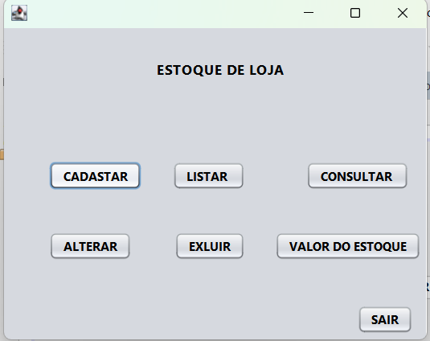
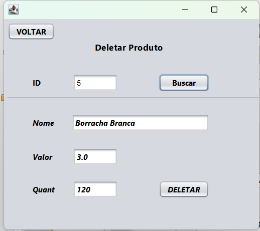

# Sistema com Banco de Dados

## 🎯 Visão geral

O **Sistema com Banco de Dados** é um projeto que  em Java , servindo como base para sistemas de cadastro e gerenciamento de informações. 

Esse projeto foi desenvolvido como exercício prático 
## 🧰 Tecnologias

- Java  
- JDBC  
- Banco de dados relacional (SQL)  
  

## ✅ Funcionalidades

- Conexão com banco de dados  
-CRUD (criar, ler, atualizar, deletar)  

## 🚀 Como rodar localmente

1. Clone o repositório  
   ```bash
   git clone https://github.com/rayssasnt/sistema-com-banco-de-dados.git

## Demonstração






